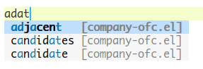
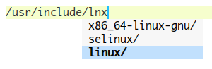

# Overview

These are fuzzy completion backends for [company-mode](https://github.com/company-mode/company-mode) of [Emacs](https://www.gnu.org/software/emacs/). `company-ofc-token` is for token completions and `company-ofc-path` for path completions.

Candidates are case sensitive but the matching behavior is not. Modified or newly inserted words of a buffer cannot be found until this buffer is saved. Candidates are sorted by their used frequencies and edit distances.

# Screenshots

## Token Completions



## Path Completions



# Installations

```lisp
;; company mode settings example

(add-to-list 'load-path "/path/to/emacs-company-ofc")

(add-hook 'prog-mode-hook (lambda ()
                            (setq-local company-backends '(company-ofc-path company-ofc-token))
                            (company-mode)))
(add-hook 'shell-mode-hook (lambda ()
                            (setq-local company-backends '(company-ofc-path))
                            (company-mode)))
```
