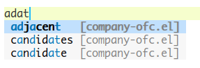
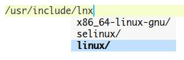

# Overview

These are fuzzy completion backends for the native Completion-At-Point-Function(`CAPF`) and [company-mode](https://github.com/company-mode/company-mode) of [Emacs](https://www.gnu.org/software/emacs/). `capf-ofc-token` and `company-ofc-token` are for token completions and `company-ofc-path` for path completions.

Candidates are case sensitive but the matching behavior is not. Modified or newly inserted words of a buffer cannot be found until this buffer is saved. Candidates are sorted by their used frequencies and edit distances.

# Screenshots

## Token Completions



## Path Completions



# Settings

## Completion-At-Point-Functions(CAPF)

```lisp
(if (< emacs-major-version 29)
    (progn
      (add-to-list 'load-path "/path/to/emacs-completion-ofc")
      (require 'capf-ofc-token))
  (unless (package-installed-p 'emacs-completion-ofc)
    (package-vc-install "https://github.com/ouonline/emacs-completion-ofc")))

(add-hook 'prog-mode-hook
          (lambda ()
            (capf-ofc-token-init)
            (setq-local completion-at-point-functions '(capf-ofc-token))))
```

## Company Mode

```lisp
(if (< emacs-major-version 29)
    (add-to-list 'load-path "/path/to/emacs-completion-ofc")
  (unless (package-installed-p 'emacs-completion-ofc)
    (package-vc-install "https://github.com/ouonline/emacs-completion-ofc")))

(add-hook 'prog-mode-hook (lambda ()
                            (setq-local company-backends '(company-ofc-token company-ofc-path))
                            (company-mode)))
(add-hook 'shell-mode-hook (lambda ()
                            (setq-local company-backends '(company-ofc-path))
                            (company-mode)))
```
